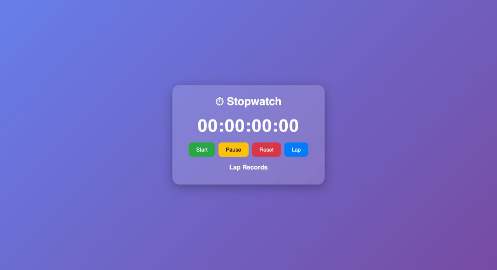

# ⏱️ PRODIGY_WD_02

## Stopwatch Web Application

This project is developed as part of the **Prodigy InfoTech Web Development Internship (Task-02)**.

The Stopwatch Web Application is built using **HTML, CSS, and JavaScript** and allows users to accurately measure time intervals with features such as start, pause, reset, and lap tracking.

---

## 🚀 Features

- Start Stopwatch
- Pause Stopwatch
- Reset Stopwatch
- Record Multiple Lap Times
- Responsive Design
- Modern User Interface
- Real-Time Time Tracking

---

## 🛠️ Technologies Used

- HTML5
- CSS3
- JavaScript (ES6)

---

## 📂 Project Structure

```
PRODIGY_WD_02/
│
├── index.html
├── style.css
├── script.js
└── README.md
```

---

## ▶️ How to Run

1. Download or clone the repository.
2. Open the project folder.
3. Run `index.html` in your browser.

Or use VS Code Live Server:

- Right-click `index.html`
- Select **Open with Live Server**

---

## 📸 Screenshot

Add your project screenshot below:



---

## 🎯 Internship Task

**Track:** Web Development

**Task-02:** Stopwatch Web Application

Build a stopwatch web application using HTML, CSS, and JavaScript with the following functionalities:

- Start Timer
- Pause Timer
- Reset Timer
- Lap Time Recording

---

## 👨‍💻 Author

**Ankit Joshi**

B.Tech CSE Student

Graphic Era Hill University

GitHub: github.com/ANKITJOSHI1605

---

## ⭐ Project Status

✅ Completed Successfully
